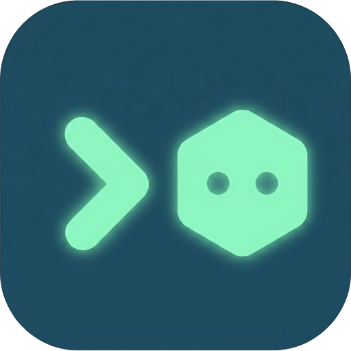

<div align="center">



# Ashide

[简体中文](./README.zh-CN.md)

**A terminal-native workspace for CLI agents across local and SSH environments.**

</div>

Ashide is for developers whose AI coding work already happens in real shells:
Codex, Claude Code, OpenCode, Gemini CLI, Google Antigravity (`agy`), and custom
shell-based agents.

It does not replace those agents, wrap them in a chatbot, or move their work
into a cloud IDE. Ashide keeps the terminal as the runtime surface, then adds
the workspace layer that long-running terminal agents are missing: environments,
sessions, projects, files, and recovery.

## The thesis

Agent work is not just a conversation. It is a live worksite made of PTYs, SSH
connections, working directories, environment variables, local files, remote
files, and machine-specific credentials.

Most agent tools try to organize that work from outside the terminal: a desktop
GUI, a web surface, or an external protocol layer. Ashide starts from the other
side. The terminal is where the work runs, so the terminal should understand the
worksite around it.

Ashide turns local and remote terminal activity into a recoverable workspace:

- environments remain explicit;
- agent sessions can be discovered instead of remembered manually;
- a session can be resumed with its cwd, environment, and project context;
- local and remote state stay separate;
- files and projects are navigable without leaving the terminal workspace.

> Agent work lives in terminals. Modern agent work spans machines. Ashide makes
> those environments and sessions durable.

## What Ashide gives you

**Agent-first sessions** — CLI agents stay real terminal processes, not hidden
chat backends. Ashide detects, indexes, and organizes their sessions. Where the
underlying agent supports it, Ashide resumes the original session instead of
pretending every agent is the same chat protocol.

**Persistent environments** — Local and SSH environments are first-class
workspace contexts. Switching environments also switches terminals, session
lists, project roots, and file views.

**Remote SSH workflow** — Ashide reads existing OpenSSH config instead of asking
you to maintain another host profile system. A connected SSH host behaves like a
workspace context: terminals run remotely, remote sessions are discovered on
that machine, and remote project/file views read remote files.

**Session bridge** — Agent history should not be trapped in one tool. Ashide is
building conversion, editing, and fork/resume flows across CLI agents such as
Codex, Claude Code, and Ashide itself.

**Lightweight IDE behavior** — Project explorer, file browser, vertical tabs,
and session navigation exist to support long-running terminal work, not to turn
Ashide into a separate IDE control plane.

**Local/offline-first** — Core session, environment, and memory state stays local
by default. Cloud, account, billing, sync, and paywall paths inherited from
upstream are being removed or replaced with local-first equivalents.

## A typical flow

1. **Launch Ashide.** It scans for installed CLI agents and indexes their
   sessions across projects and working directories.
2. **Resume the right worksite.** The session navigator shows discovered agent
   sessions. Pick one and Ashide restores the cwd, environment, and project
   context needed to continue.
3. **Move across environments.** Switch from local to an SSH environment and see
   the sessions, terminals, and files that belong to that machine.
4. **Move across agents.** When supported, convert or fork a conversation so the
   work can continue in another CLI agent instead of staying locked in one
   history store.

## Cross-agent session conversion

CLI agents each keep their conversation history in their own on-disk format:
Codex stores JSONL under `~/.codex/sessions`, Claude Code stores JSONL under
`~/.claude/projects`, and so on. These stores are not interchangeable. A
conversation that started in Codex cannot be opened by Claude Code just by
pointing it at Codex's file.

Ashide's session bridge converts between these native formats instead of
copying a prompt into a new chat. The path is:

1. **Read** the source agent's native history (its real session files on local
   or remote disk) through a per-agent reader.
2. **Normalize** it into a shared intermediate representation (SessionIR): a
   ordered list of messages with roles, text, timestamps, and any artifacts
   (commands, file edits, tool calls) the agent produced.
3. **Edit / trim / sanitize** the IR — drop turns, fix paths, redact, or split a
   focused fork from selected turns — before anything is written.
4. **Write** the IR back out in the *target* agent's native format, into that
   agent's real session store, so the target agent can resume it as one of its
   own sessions rather than receiving a pasted blob.

It is not a wrapper around the agents' private APIs — it reads and writes the
history files they already keep on disk. Support is per agent and depends on
each agent's history format being stable enough to read and resume; not every
agent and not every turn type converts cleanly yet.

A portable bundle export/import exists for moving a conversation between
machines without exposing the source machine's session store.

## Remote runtime delivery

Remote support should not depend on the remote host being able to reach GitHub.
The release path is intentionally local-first:

1. Ashide probes the SSH target to determine its OS and architecture.
2. The local app downloads the matching remote helper from GitHub Releases, for
   example `ashide-<os>-<arch>.tar.gz`, into a local cache.
3. Ashide uploads the extracted helper over the existing SSH connection using
   `rsync` when available, or `scp` plus an atomic replace fallback.
4. The remote machine runs the uploaded helper; it does not need GitHub access
   or GitHub credentials.

For source/debug builds, Ashide builds the matching helper locally and uploads
that exact artifact instead of falling back to a stale public release. This keeps
the client and remote protocol in lockstep while still preserving the same
local-first delivery model.

## Platform and release policy

Ashide is developed and verified on macOS today, but it is not intended to be a
macOS-only project. The Warp/zap foundation is cross-platform, and Ashide keeps
that direction wherever the product architecture still supports it.

The practical release baseline is:

- publish at least a verified macOS desktop build;
- publish versioned remote helper archives for the remote platforms Ashide can
  safely probe and upload to;
- accept Linux and Windows desktop support when there is CI, hardware, or
  maintainer coverage to verify it.

If a platform does not have an official binary yet, that usually means the
maintainer cannot currently build and test it, not that the project has chosen
to abandon the platform. Community-maintained builds and fixes are welcome.

## Status

Ashide is early and incomplete. Remote SSH UX is evolving, agent session
indexing/restoration is experimental, cloud removal is ongoing, and UI polish
and localization are unfinished. Expect breaking changes.

**This is primarily a personal project.** The maintainer builds Ashide for their
own daily agent work first; open-sourcing it is a side effect of that, not a
product launch. There is no release schedule, no SLA, and no commitment to ship
a particular feature or fix on any timeline. Development may be quiet for a long
while and then move in bursts; release cadence is not a reliable signal of
project health. If you need dependable updates, fast support, or a stable
roadmap, this project will probably frustrate you — and forking it or building
your own derivative is a completely valid response.

Contributions are welcome: pull requests, bug reports, documentation fixes, and
feature discussions. If Ashide's direction is close but not quite yours, forks
and derivative projects are explicitly encouraged.

## What Ashide is not

- Not a cloud IDE.
- Not a chatbot UI.
- Not a hosted agent runtime.
- Not an ACP-style attempt to pull agents out of the terminal into a separate
  protocol/control plane.
- Not trying to replace your CLI agents; it organizes the environments and
  sessions they already use.

## Documentation

- [Documentation index](docs/README.md) · [Roadmap](docs/roadmap.md)
- [Remote SSH model](docs/REMOTE_SSH.md) · [Agent session model](docs/AGENT_SESSIONS.md)
- [Development guide](docs/DEVELOPMENT.md)

## Roadmap

The terminal-native workspace is the foundation. The direction beyond it:

- **Cross-agent shared memory** — a project-local, agent-agnostic memory layer
  (`.agents/memory`) so context survives across sessions and agents.
- **Codegraph index** — a rebuildable, revision-aware codegraph that gives
  agents focused code slices on demand instead of dumping the whole repository
  into context.
- **Reusable agent harness** — a local-first agent runtime for tool execution,
  session state, and provider routing, with the terminal as the first client.

Explicitly not planned: a hosted cloud agent runtime, a separate web/desktop IDE
control plane, or an external protocol takeover that makes the terminal a thin
view over something else.

## Relationship to upstream

Ashide builds on two layers of upstream work, plus third-party libraries.

- **Warp** ([warpdotdev/warp](https://github.com/warpdotdev/warp)) — the
  original terminal codebase. Most of Ashide's terminal, editor, and UI
  foundation originates here.
- **zap** ([zerx-lab/zap](https://github.com/zerx-lab/zap)) — a second-stage
  development on top of Warp. Ashide is a further independent line on top of
  zap. Thanks to zap and its maintainers.

Ashide is not maintained as an upstream-tracking fork. It carries forward the
foundation while cutting cloud-dependent and account-dependent paths that do not
fit the local/offline-first direction.

Internal Rust crates keep their upstream `warp*` / `warpui*` names as an
acknowledgment of the foundation they build on; user-facing surfaces are
rebranded to Ashide.

**Third-party libraries:** `rust-genai` (local fork under `lib/rust-genai` with
DeepSeek / custom-provider support), plus `core-foundation`, `objc`, `tink`,
`jemalloc`, and others pinned via `[patch.crates-io]`. Each retains its own
upstream license; see [NOTICE.md](./NOTICE.md) and `Cargo.lock`.

## Build from source

Source builds are the safest way to try unreleased work. macOS is the only
desktop platform currently verified by the maintainer.

```bash
MACOSX_DEPLOYMENT_TARGET=10.14 cargo build --bin ashide
TERM=xterm-256color MACOSX_DEPLOYMENT_TARGET=10.14 ./script/run
```

See [docs/DEVELOPMENT.md](docs/DEVELOPMENT.md) for more.

## On the name

Ashide (阿史德) is an ancient Turkic clan name. Some scholars derive both Ashide
(阿史德 *’âşitək) and Ashina (阿史那 *’âşinâ) from the Proto-Turkic root *aş-
("to cross [a mountain]").

The name fits the project: Ashide is about crossing between machines,
environments, agents, and work sessions while keeping the terminal as the place
where the work actually runs. It also nods to Warp — a word with the sense of
threading, traversing, and throwing across — while marking a separate path.

Put differently, Ashide is **agent-first**: the AI agent is the driving force,
but its hands are the **shell** — commands, files, and processes run in a real
terminal, not absorbed into an abstraction. That terminal is itself a full
**IDE**: editing, viewing, search, and session management all live in one
workspace, so you don't shuttle between an agent window and a terminal window.
What the agent thinks of happens in the terminal; what happens in the terminal,
the agent can pick up.

## License

Ashide retains upstream copyright and license notices. See
[NOTICE.md](NOTICE.md) and [LICENSE-AGPL](LICENSE-AGPL). New Ashide-specific
changes are distributed under the same compatible license terms unless
otherwise stated.
